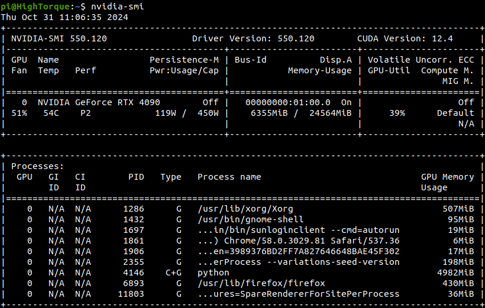
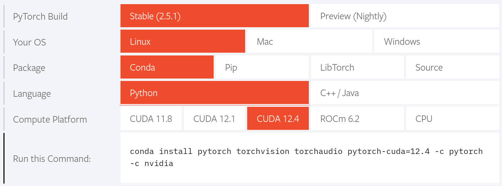

# Pi_rl_baseline

该基线工作提供了一个基于 NVIDIA Isaac Gym 的强化学习环境，对 高擎机电的双足机器人 Pi Pi_rl_baseline 还整合了从 Isaac Gym 到 Mujoco 的sim2sim框架，使用户能够在不同的物理模拟中验证训练得到的策略，以确保策略的稳健性和泛化能力。

## 安装

1. 使用 `miniconda` 或 `anaconda` 创建一个虚拟环境 `conda create -n pi_env python=3.8`.
2. 使用 `apt` 安装nvidia显卡驱动 `sudo apt install nvidia-driver-525`,驱动版本至少为515，因为驱动是向下兼容的，所以也可以安装更高版本的驱动。安装完成后，在命令行中使用命令 `nvidia-smi` 以查看驱动的CUDA版本。可以看到示例图片中的CUDA版本为12.4，驱动版本为550。

   
3. 安装最新版本的 `Pytorch` : 进入 `Pytorch` 官网 https://pytorch.org/ ，`Package `选项选择 `Conda `,`Compute Platform`选择合适的 `CUDA` 版本。`CUDA` 是一个向下兼容，但不向上兼容的软件库，所以所选择的 `CUDA` 版本要小于等于电脑安装的版本。

   

   ```
   conda install pytorch torchvision torchaudio pytorch-cuda=12.4 -c pytorch -c nvidia
   ```
4. 使用 `conda` 安装numpy `conda install numpy=1.23`.
5. 安装 `Isaac Gym`:

   - 在Nvidia官网下载并安装 `Isaac Gym Preview 4` `https://developer.nvidia.com/isaac-gym`.
   - 激活conda环境，并进入 `isaacgym`的包中进行安装 ： `cd isaacgym/python && pip install -e .`
   - 可以通过运行自带的示例脚本，测试环境安装是否成功： `cd examples && python 1080_balls_of_solitude.py`.
   - 请参阅 `isaacgym/docs/index.html` 以进行故障排除。
6. 安装本baseline:

   - 克隆此仓库： `git clone https://github.com/HighTorque-Locomotion/pi_rl_baseline.git`.
   - `cd pi_rl_baseline && pip install -e .`

## Usage Guide

#### Examples

```bash
# 使用 4096 个环境，并以“v1”为训练版本进行 PPO policy 训练
# 该命令将会开始机器人的训练任务.
python scripts/train.py --task=pai_ppo --run_name v1 --headless --num_envs 4096

# 评估训练好的policy
# 此命令将会加载“v1”policy以在其环境中进行性能评估。
# 此外，它还会自动导出适合部署目的的 JIT 模型。
python scripts/play.py --task=pai_ppo --run_name v1

# 通过使用Mujoco实现sim2sim
python scripts/sim2sim.py --load_model /path/to/logs/Pai_ppo/exported/policies/policy_1.pt

# 运行我们提供的训练好的policy
python scripts/sim2sim.py --load_model /path/to/logs/Pai_ppo/exported/policies/policy_example.pt
```

#### Parameters

- **CPU and GPU Usage**: 使用CPU运行仿真, 同时设置 `--sim_device=cpu` 和 `--rl_device=cpu`. 使用指定GPU运行仿真，同时设置 `--sim_device=cuda:{0,1,2...}` 和 `--rl_device={0,1,2...}`. 请注意，`CUDA_VISIBLE_DEVICES` 不适用，并且匹配 `--sim_device` 和 `--rl_device` 的设置至关重要。
- **Headless Operation**: 使用 `--headless` 参数用于无渲染运行.
- **Rendering Control**: 在训练期间按 `v` 键开启或关闭渲染.
- **Policy Location**: 训练好的模型保存在 `humanoid/logs/<experiment_name>/<date_time>_<run_name>/model_<iteration>.pt`.


#### Command-Line Arguments

进行RL训练，请参考 `humanoid/utils/helpers.py`.
进行sim2sim，请参考 `humanoid/scripts/sim2sim.py`.


1. 每个环境都依赖于一个 `env` 文件（`legged_robot.py`）和一个 `config` 文件（`legged_robot_config.py`）。后者包含两个类：`LeggedRobotCfg`（包含所有环境参数）和 `LeggedRobotCfgPPO`（表示所有训练参数）。
2. `env` 和 `config` 类都使用继承。
3. `cfg` 中指定的非零奖励将相应名称的函数贡献给总奖励。
4. 必须使用 `task_registry.register(name, EnvClass, EnvConfig, TrainConfig)` 注册任务。注册可能发生在 `envs/__init__.py` 内，也可能发生在此存储库之外。

## Add a new environment

基础环境“legged_robot”构建了一个崎岖地形运动任务。相应的配置未指定机器人资产（URDF/MJCF）和奖励量表。

1. 如果您需要添加新环境，请在“envs/”目录中创建一个新文件夹，其中包含名为“<your_env>_config.py”的配置文件。新配置应继承自现有环境配置。
2. 如果提议使用新机器人：

   - 将相应的资产插入“resources/”文件夹中。
   - 在“cfg”文件中，设置资产的路径，定义主体名称、default_joint_positions 和 PD 增益。指定所需的“train_cfg”和环境的名称（python 类）。
   - 在“train_cfg”中，设置“experiment_name”和“run_name”。

3. 如果需要，请在“<your_env>.py”中创建您的环境。从现有环境继承，覆盖所需功能和/或添加您的奖励功能。
4. 在 `humanoid/envs/__init__.py` 中注册您的环境。
5. 根据需求修改或调整 `cfg` 或 `cfg_train` 中的其他参数。要删除奖励，请将其比例设置为零。避免修改其他环境的参数！
6. 如果您想要新的机器人/环境来执行 sim2sim，您可能需要修改 `humanoid/scripts/sim2sim.py`：

   - 检查 MJCF 和 URDF 之间的机器人关节映射。
   - 根据您训练的策略更改机器人的初始关节位置。

## Acknowledgment

pai_rl_baseline 的实现依赖于 [legged_gym](https://github.com/leggedrobotics/legged_gym) 项目的资源。
